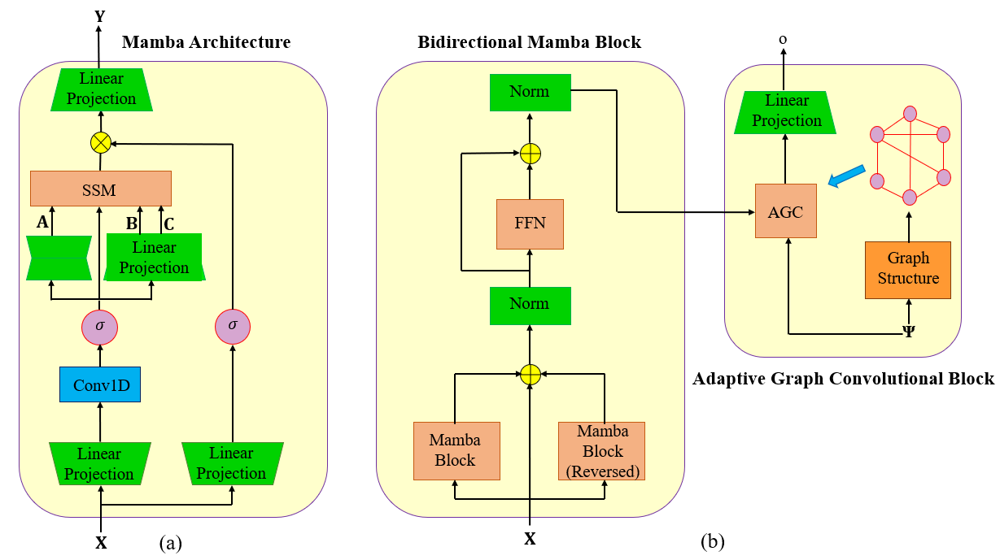

# SAMBA: A Graph-Mamba Approach for Stock Price Prediction

<p align="center">
  
  <br>
</p>

This is the official Pytorch implementation of the SAMBA, which is proposed in our paper ["Mamba Meets Finacial Markets: A Graph-Mamba Approach for Stock Price Prediction"](https://arxiv.org/pdf/2410.03707) accepted for publication in *IEEE ICASSP*, 2025.

## Installation

First, check the requirements as follows:\
python\
numpy\
pandas\
einops\
pytorch

Then clone the repository as follows:
```shell
git clone https://github.com/Ali-Meh619/SAMBA.git
```

## Dataset
We utilize three real-world datasets from the US stock market with 82 daily stock features: NASDAQ, New York Stock Exchange (NYSE), and Dow Jones Industrial Average (DJIA), covering the period from January 2010 to November 2023.

## Description

The file "Dataset" file contains the code for generating the training and test datasets.\
The file "Model" file contains the code for the SAMBA learning algorithm.\
The file "Training" file contains the code for designing the loss function and the training process.\
The file "Execution" file contains the code for running the model, model parameters, and performance metrics in the training and test phases.


## Citation

If you find our paper and code useful, please kindly cite our paper as follows:
```bibtex
@INPROCEEDINGS{samba,
  author={Mehrabian, Ali and Hoseinzade, Ehsan and Mazloum, Mahdi and Chen, Xiaohong},
  booktitle={Proc. IEEE Int. Conf. Acoust., Speech, Signal Process. (ICASSP)}, 
  title={Mamba Meets Finacial Markets: {A} Graph-{M}amba Approach for Stock Price Prediction}, 
  year={2025},
address={Hyderabad, India},
month={Apr.}}
```

## Contact

Please feel free to contact us if you have any questions:
- Ali Mehrabian: alimehrabian619@{ece.ubc.ca, yahoo.com}

